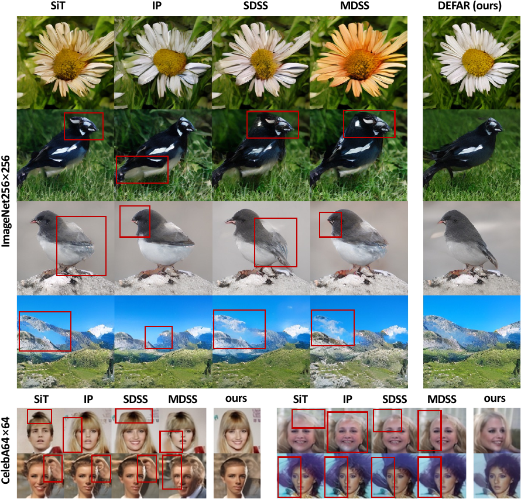
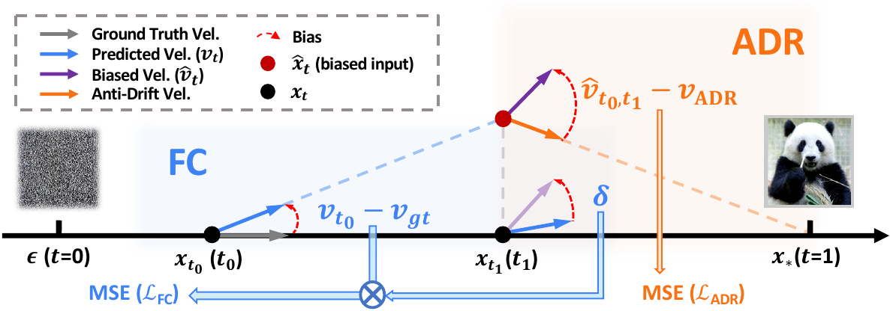
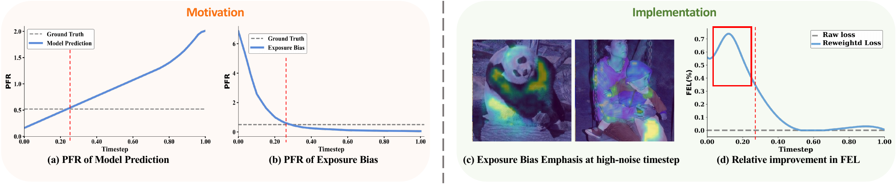

# Exposure Bias Can Alleviate Itself via Directional and Frequency Rectification in Flow Matching

### DEFAR: Directional-Frequency Adaptive Rectification

  
  
  
  

  <a href="#highlights">Highlights</a> |
  <a href="#method-overview">Method</a>

**[Guanbo Huang](https://wuliwuliy.github.io/)1,2,*,&Dagger;**,
**[Jingjia Mao](https://openreview.net/profile?id=~Jingjia_Mao1)1,2,*,&Dagger;**,
**[Fanding Huang](https://hf618.github.io/)1,***,
**[Fengkai Liu](https://liufeeky.github.io/)1**,
**[Xiangyang Luo](https://luoxyhappy.github.io/)1**,
**[Yaoyuan Liang](https://scholar.google.com/citations?user=n47YI20AAAAJ&hl=zh-CN&oi=sra)1**,
**[Jiasheng Lu](https://scholar.google.com/citations?user=uHeYEtEAAAAJ&hl=en)2**,
**[Xiaoe Wang](https://sites.google.com/view/wangxiaoe1/%E9%A6%96%E9%A1%B5)2**,
**[Pei Liu](https://github.com/windelvin?tab=projects)2**,
**[Ruiliu Fu](https://dblp.org/pid/304/2996.html)2,&dagger;**,
**[Ruqi Huang](https://rqhuang88.github.io/)1,&dagger;**,
**[Shao-Lun Huang](https://sites.google.com/view/slhuang/home)1,&dagger;**

1Tsinghua Shenzhen International Graduate School, Tsinghua University  
2Central Media Technology Institute, Huawei

* Equal contribution.  
&dagger; Corresponding authors.  
&Dagger; Work conducted during internship at Central Media Technology Institute, Huawei.

## Highlights

DEFAR studies exposure bias in Flow Matching and shows that the bias itself can provide useful self-feedback signals. Instead of only suppressing exposure bias with static alignment or external heuristics, DEFAR simulates one-step inference during training and uses the resulting bias to adaptively rectify the model in two complementary dimensions.

- **Anti-Drift Rectification (ADR)** learns a restorative direction that steers drift-affected states back toward the data distribution.
- **Frequency Compensation (FC)** uses exposure bias as a negative-feedback weight to reinforce missing low-frequency components at high-noise timesteps.
- DEFAR improves image generation across CIFAR-10, CelebA-64, ImageNet-256, and ImageNet-512, while remaining compatible with stronger backbones and complementary mitigation strategies.

  
   
  Qualitative comparison under the same random seed and 50-NFE inference. DEFAR produces more coherent structures and cleaner object-background boundaries.

## Method Overview

  

DEFAR augments the Flow Matching objective with two self-rectifying signals obtained from exposure bias. ADR operates on the directional drift induced by one-step inference simulation, while FC operates on the frequency deficiency revealed by the bias signal. The final objective jointly optimizes the ADR regularizer and the FC-reweighted Flow Matching loss.

  
   
  Exposure bias highlights low-frequency information that the raw prediction under-emphasizes at high-noise timesteps, motivating FC.

## Star History

